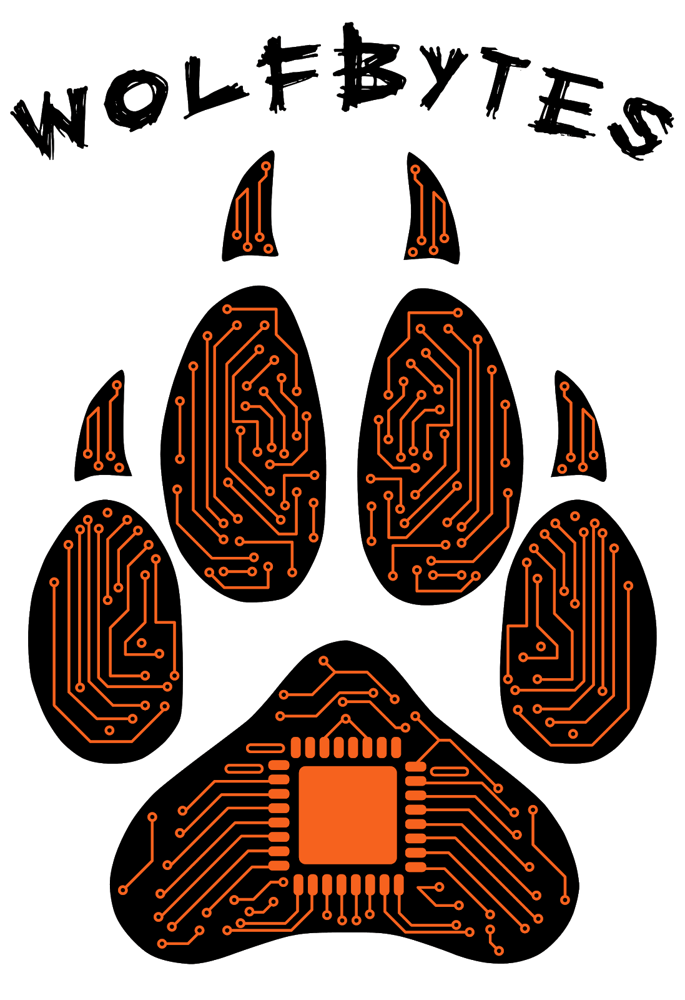

# Problem
We chose the problem related to exercise of adults not having enough time or the
knowledge of how to get exercise. Many adults have busy work schedules, and
don’t have much time or space to work out.

According to the United States Department of Health and Human Services “Only
about one in five homes [in the US] have parks within a half-mile, and about the
same number have a fitness or recreation center within that distance.” They also
said that “More than 80% of adults [in the US] do not meet the guidelines for bo
th aerobic and muscle-strengthening activities." [1]

Most adults either can’t fit in enough time in the day, or if they do they can’t
get to the right space or both.

# Solution
Fitstart is an app that gives you 5, 10, or 15-minute exercise videos or a page
to read about what you should do so people can exercise in small portions in
their day. The app gives you a survey when you sign up for the exercises you can
complete, i.e, whether your block is safe to walk around, which you can change
whenever. When you complete an exercise you get a badge.

Part of the app is a competition based on the badges you get. For the single
person competition, you are sorted into a random group of users and compete
against them for who can get the most badges. You can only get 7 badges a week,
because we don’t want people to over exercise. Every time you get a badge you
get XP. XP can be used to change the background, color of text, profile pic,
etc. If you get 1st , 2nd or 3rd place in the competition you get XP. The
leaderboard can be turned off if you don’t want the competition. You can friend
people on FitStart, and you form teams. There is a separate teams leaderboard.
The average number of badges for your team puts your team in a place. The top 3
teams get XP. Or you can compete only against your team in a single team
leaderboard. Or both.

If you get 5/7 badges for the week, you get to adopt a virtual pet and improve
your virtual house with addons, like supplies for your cat, furniture, and
additional pets. If you don’t exercise, your pet destroys some of your addons.
This encourages people who may not be competitive to do their exercise.

# Bibliography
[1]: [Department of Health & Human Services](https://www.hhs.gov/fitness/resource-center/facts-and-statistics/index.html)
